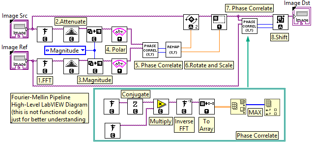
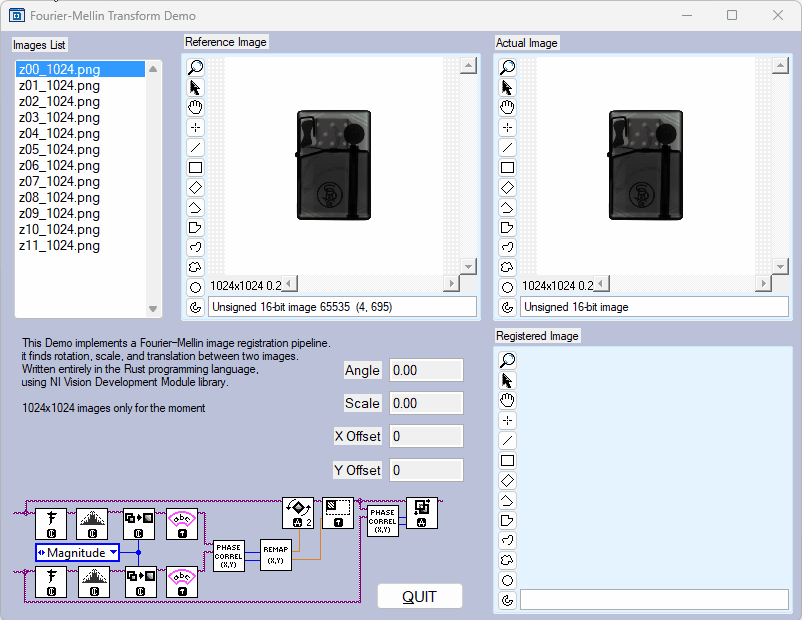

# Fourier-Mellin
Image Registration Algorithm implemented in Rust

The **Fourier–Mellin transform** is a powerful image registration technique widely used to align images that differ by **translation**, **rotation**, and **scale**. Unlike many spatial‑domain methods, the Fourier–Mellin approach operates in the **frequency domain**, making it robust, efficient, and well‑suited for real‑time or large‑scale processing tasks.

Fourier–Mellin registration is commonly applied in scenarios where images of the same object or scene appear at different scales or orientations:

- **Remote sensing and satellite imagery** — matching overlapping aerial photos where scale and angle change.
- **Robotics and navigation** — aligning camera frames during robot localization or map building.
- **Medical imaging** — comparing scans taken with different zoom levels or patient orientations.
- **Object and pattern recognition** — identifying objects independent of size and rotation.

Its invariance to rotation and scaling makes it especially valuable when camera parameters or object distances are not fixed.

## Explanation

To understand how the Fourier–Mellin method works, you only need to grasp two key ideas about how images behave under the Fourier Transform:

### **1. The Fourier Shift Theorem**

The Fourier Shift Theorem says:

> **If you shift an image in the spatial domain, its Fourier transform stays the same in magnitude but its phase gets multiplied by a complex exponential.**

In simple terms:

- Moving an image left/right/up/down
   → does **not** change its frequency magnitudes
   → only changes its **phase** (as a predictable pattern)

This is why **phase correlation** works so well for finding translation:
 the shift becomes a simple multiplication that we can detect by comparing phases.

------

### **2. Rotation in the image causes rotation in its Fourier magnitude spectrum**

Another important fact is:

> **If you rotate an image, the Fourier magnitude spectrum rotates by the same angle.**

This means rotation is *preserved* and visible in the magnitude spectrum.

By converting the Fourier magnitude spectrum into **polar** (or **log‑polar**) coordinates:

- rotation becomes a **vertical  shift**
- scale becomes a **horizontal shift** (depends on log‑polar implementation)

After this transformation, rotation and scale differences between two images become **pure translations**, allowing phase correlation to estimate them efficiently.

The entire processing pipeline, represented here as “LabVIEW-style pseudocode,” looks like this:



## Rust Implementation

below is a simplified example following the pipeline described above:

```rust
fn fourier_mellin(
	src: *const Image,
	reference: *const Image,
	dst: *mut Image,
) -> std::result::Result<ComputeResult, i32> {
	// Validate input image pointers before calling the NI Vision API.
	if src.is_null() || reference.is_null() || dst.is_null() {
		return Err(ERR_NOT_IMAGE);
	}

	// Cast input images (e.g., U16) to 32-bit float for frequency-domain processing.
	let src_f32 = imaq_create_image(ImageType_enum_IMAQ_IMAGE_SGL);
	let ref_f32 = imaq_create_image(ImageType_enum_IMAQ_IMAGE_SGL);
	imaq_cast_simple(src_f32, src, ImageType_enum_IMAQ_IMAGE_SGL);
	imaq_cast_simple(ref_f32, reference, ImageType_enum_IMAQ_IMAGE_SGL);

	// 1.Compute the forward FFT of both images.
	let src_fft = imaq_create_image(ImageType_enum_IMAQ_IMAGE_COMPLEX);
	let ref_fft = imaq_create_image(ImageType_enum_IMAQ_IMAGE_COMPLEX);
	imaq_fft(src_fft, src_f32); //FFT
	imaq_fft(ref_fft, ref_f32);

	// 2.Attenuate high frequencies and shift the zero-frequency component to the center.
	imaq_attenuate(src_fft, src_fft, 1);
	imaq_attenuate(ref_fft, ref_fft, 1);
	imaq_flip_frequencies(src_fft, src_fft);
	imaq_flip_frequencies(ref_fft, ref_fft);

	// 3.Extract magnitude spectra from the complex Fourier images.
	let src_magnitude = imaq_create_image(ImageType_enum_IMAQ_IMAGE_SGL);
	let ref_magnitude = imaq_create_image(ImageType_enum_IMAQ_IMAGE_SGL);
	imaq_extract_complex_plane(src_magnitude, src_fft, ComplexPlane_enum_IMAQ_MAGNITUDE);
	imaq_extract_complex_plane(ref_magnitude, ref_fft, ComplexPlane_enum_IMAQ_MAGNITUDE);

	// 4.Transform magnitude spectra into log-polar coordinates (for scale and rotation estimation).
	let src_polar = imaq_create_image(ImageType_enum_IMAQ_IMAGE_SGL);
	let ref_polar = imaq_create_image(ImageType_enum_IMAQ_IMAGE_SGL);
	imaq_log_polar_transform(src_polar, src_magnitude);
	imaq_log_polar_transform(ref_polar, ref_magnitude);

	// 5.Estimate relative scale and rotation using phase correlation in the log-polar domain.
	let (max_x_scale, max_y_angle) = imaq_phase_correlate(src_polar, ref_polar);
	let (_width, height) = imaq_get_image_size(src);
	// Convert vertical/hor peak position to a rotation angle in degrees
	let angle = max_y_angle as f32 / (height as f32 / 360.0); // Fill height is 360 degrees
	let scale = scale_for_factor(max_x_scale as f32);
	println!("transform ({} (scale), {} (angle))", scale, angle);

	// 6.Apply the estimated rotation and scale to the source image.
	let dst_rotated = imaq_create_image(ImageType_enum_IMAQ_IMAGE_SGL);
	imaq_rotate_resample(dst_rotated, src_f32, angle, scale);

	// 7.Estimate the remaining translation using phase correlation in the spatial domain.
	let (max_x1, max_y1) = imaq_phase_correlate(dst_rotated, ref_f32);

	// 8.Apply the estimated translation and saturate out-of-bounds pixels.
	let shifted: *mut Image_struct = imaq_create_image(ImageType_enum_IMAQ_IMAGE_SGL);
	imaq_shift(shifted, dst_rotated, max_x1, max_y1, SATURATE);

	// 9.Copy the registered image into the output image.
	imaq_duplicate(dst, shifted);

	// Dispose of all temporary images to free NI Vision resources.
	imaq_dispose_image(src_f32);
	//... ref_f32 and so on

	Ok(ComputeResult { rotation: angle as f32, scale: scale as f32, x_shift: max_x1 as f32, y_shift: max_y1 as f32 })
}
```



This is a demonstration with minimal error handling. Only **1024×1024** images are supported.

## Requirements

You will need at least [Rust Programming Language](https://rust-lang.org/) (v.1.93.1 was used) and [bindgen](https://rust-lang.github.io/rust-bindgen/requirements.html) (v.0.72.1).

cargo.toml:

```
[package]
name = "fourier_mellin"
version = "0.1.0"
edition = "2024"

[dependencies]

[build-dependencies]
bindgen = "0.72.1"
```

To modify User Interface part you will need also [NI LabWindows/CVI](https://www.ni.com/en/support/downloads/software-products/download.labwindows-cvi.html) Development Environment (v.2020 f3 was used) together with [NI Vision Development Module](https://www.ni.com/en/support/downloads/software-products/download.vision-development-module.html) (v.2025Q3). To modify Rust code only it is sufficient toa have Rust with bindgen.

To Run this demo application you need [LabWindows/CVI Runtime](LabWindows/CVI Runtime) as well as [Vision Development Module Runtime](https://www.ni.com/en/support/downloads/software-products/download.vision-development-module-runtime.html) installed.

## Useful Links

B. S. Reddy and B. N. Chatterji, “An FFT-based Technique for Translation, Rotation, and Scale-Invariant Image Registration,” IEEE Transactions on Image Processing, vol. 5, no. 8, pp. 1266–1271, 1996. - [1996_Reddy_Chatterji_fft_based_trans_rot_scale_invar_registr.pdf](https://dev.ipol.im/~reyotero/bib/bib_all/1996_Reddy_Chatterji_fft_based_trans_rot_scale_invar_registr.pdf).

Image registration based on the Fourier-Mellin transform - [OpenCV implementation](https://github.com/sthoduka/imreg_fmt).

Fourier-Mellin Transform using [OpenCV with Python Bindings](https://github.com/htoik/fourier-mellin).

Fourier-Mellin Transform using [MATLAB](https://de.mathworks.com/matlabcentral/fileexchange/160961-fourier-mellin-transform-for-image-registration).

Enloy!